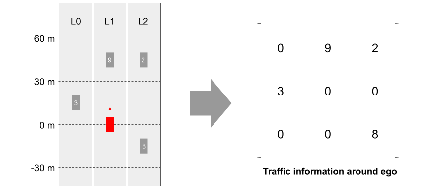
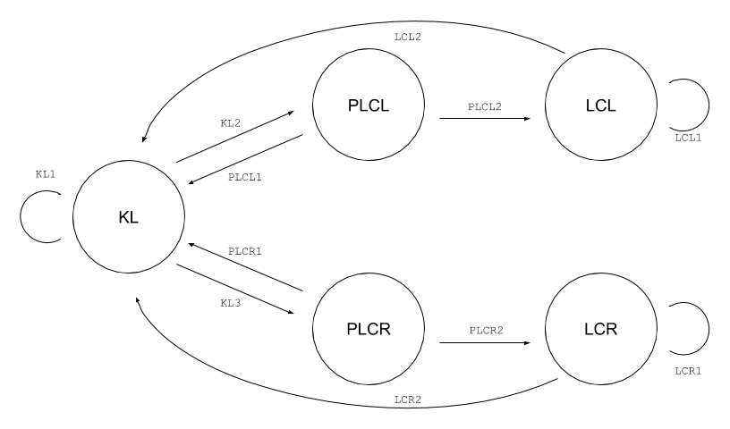

# CarND-Path-Planning-Project
Self-Driving Car Engineer Nanodegree Program
   
### Simulator.
You can download the Term3 Simulator which contains the Path Planning Project from the [releases tab (https://github.com/udacity/self-driving-car-sim/releases/tag/T3_v1.2).  

To run the simulator on Mac/Linux, first make the binary file executable with the following command:
```shell
sudo chmod u+x {simulator_file_name}
```

### Goals
In this project your goal is to safely navigate around a virtual highway with other traffic that is driving +-10 MPH of the 50 MPH speed limit. You will be provided the car's localization and sensor fusion data, there is also a sparse map list of waypoints around the highway. The car should try to go as close as possible to the 50 MPH speed limit, which means passing slower traffic when possible, note that other cars will try to change lanes too. The car should avoid hitting other cars at all cost as well as driving inside of the marked road lanes at all times, unless going from one lane to another. The car should be able to make one complete loop around the 6946m highway. Since the car is trying to go 50 MPH, it should take a little over 5 minutes to complete 1 loop. Also the car should not experience total acceleration over 10 m/s^2 and jerk that is greater than 10 m/s^3.

#### The map of the highway is in data/highway_map.txt
Each waypoint in the list contains  [x,y,s,dx,dy] values. x and y are the waypoint's map coordinate position, the s value is the distance along the road to get to that waypoint in meters, the dx and dy values define the unit normal vector pointing outward of the highway loop.

The highway's waypoints loop around so the frenet s value, distance along the road, goes from 0 to 6945.554.

## Basic Build Instructions

1. Clone this repo.
2. Make a build directory: `mkdir build && cd build`
3. Compile: `cmake .. && make`
4. Run it: `./path_planning`.

Here is the data provided from the Simulator to the C++ Program

#### Main car's localization Data (No Noise)

["x"] The car's x position in map coordinates

["y"] The car's y position in map coordinates

["s"] The car's s position in frenet coordinates

["d"] The car's d position in frenet coordinates

["yaw"] The car's yaw angle in the map

["speed"] The car's speed in MPH

#### Previous path data given to the Planner

//Note: Return the previous list but with processed points removed, can be a nice tool to show how far along
the path has processed since last time. 

["previous_path_x"] The previous list of x points previously given to the simulator

["previous_path_y"] The previous list of y points previously given to the simulator

#### Previous path's end s and d values 

["end_path_s"] The previous list's last point's frenet s value

["end_path_d"] The previous list's last point's frenet d value

#### Sensor Fusion Data, a list of all other car's attributes on the same side of the road. (No Noise)

["sensor_fusion"] A 2d vector of cars and then that car's [car's unique ID, car's x position in map coordinates, car's y position in map coordinates, car's x velocity in m/s, car's y velocity in m/s, car's s position in frenet coordinates, car's d position in frenet coordinates. 

## Details

1. The car uses a perfect controller and will visit every (x,y) point it recieves in the list every .02 seconds. The units for the (x,y) points are in meters and the spacing of the points determines the speed of the car. The vector going from a point to the next point in the list dictates the angle of the car. Acceleration both in the tangential and normal directions is measured along with the jerk, the rate of change of total Acceleration. The (x,y) point paths that the planner recieves should not have a total acceleration that goes over 10 m/s^2, also the jerk should not go over 50 m/s^3. (NOTE: As this is BETA, these requirements might change. Also currently jerk is over a .02 second interval, it would probably be better to average total acceleration over 1 second and measure jerk from that.

2. There will be some latency between the simulator running and the path planner returning a path, with optimized code usually its not very long maybe just 1-3 time steps. During this delay the simulator will continue using points that it was last given, because of this its a good idea to store the last points you have used so you can have a smooth transition. previous_path_x, and previous_path_y can be helpful for this transition since they show the last points given to the simulator controller with the processed points already removed. You would either return a path that extends this previous path or make sure to create a new path that has a smooth transition with this last path.

## Tips

A really helpful resource for doing this project and creating smooth trajectories was using http://kluge.in-chemnitz.de/opensource/spline/, the spline function is in a single hearder file is really easy to use.

---

## Dependencies

* cmake >= 3.5
  * All OSes: [click here for installation instructions](https://cmake.org/install/)
* make >= 4.1
  * Linux: make is installed by default on most Linux distros
  * Mac: [install Xcode command line tools to get make](https://developer.apple.com/xcode/features/)
  * Windows: [Click here for installation instructions](http://gnuwin32.sourceforge.net/packages/make.htm)
* gcc/g++ >= 5.4
  * Linux: gcc / g++ is installed by default on most Linux distros
  * Mac: same deal as make - [install Xcode command line tools]((https://developer.apple.com/xcode/features/)
  * Windows: recommend using [MinGW](http://www.mingw.org/)
* [uWebSockets](https://github.com/uWebSockets/uWebSockets)
  * Run either `install-mac.sh` or `install-ubuntu.sh`.
  * If you install from source, checkout to commit `e94b6e1`, i.e.
    ```
    git clone https://github.com/uWebSockets/uWebSockets 
    cd uWebSockets
    git checkout e94b6e1
    ```

## Editor Settings

We've purposefully kept editor configuration files out of this repo in order to
keep it as simple and environment agnostic as possible. However, we recommend
using the following settings:

* indent using spaces
* set tab width to 2 spaces (keeps the matrices in source code aligned)

## Code Style

Please (do your best to) stick to [Google's C++ style guide](https://google.github.io/styleguide/cppguide.html).

## Project Instructions and Rubric

Note: regardless of the changes you make, your project must be buildable using
cmake and make!


## Call for IDE Profiles Pull Requests

Help your fellow students!

We decided to create Makefiles with cmake to keep this project as platform
agnostic as possible. Similarly, we omitted IDE profiles in order to ensure
that students don't feel pressured to use one IDE or another.

However! I'd love to help people get up and running with their IDEs of choice.
If you've created a profile for an IDE that you think other students would
appreciate, we'd love to have you add the requisite profile files and
instructions to ide_profiles/. For example if you wanted to add a VS Code
profile, you'd add:

* /ide_profiles/vscode/.vscode
* /ide_profiles/vscode/README.md

The README should explain what the profile does, how to take advantage of it,
and how to install it.

Frankly, I've never been involved in a project with multiple IDE profiles
before. I believe the best way to handle this would be to keep them out of the
repo root to avoid clutter. My expectation is that most profiles will include
instructions to copy files to a new location to get picked up by the IDE, but
that's just a guess.

One last note here: regardless of the IDE used, every submitted project must
still be compilable with cmake and make./

## How to write a README
A well written README file can enhance your project and portfolio.  Develop your abilities to create professional README files by completing [this free course](https://www.udacity.com/course/writing-readmes--ud777).

--

## Model Documentation

I generated paths by the following two steps: 

1. Changing a state using Finite State Machine.
2. Generating a trajectory based on the state changed in the above step.

Details of these two steps are described in the following sub sections.

### Changing a state using Finite State Machine

I defined 5 behavior states: KL (Keep Lane), PLCL (Prepare Lane Change Left), LCL(Lane Change Left), PLCR (Prepare Lane Change Right), and LCR (Lane Change Right). I used Finite State Machine and traffic information around the ego vehicle to make transitions between these states. The following image shows the concept of traffic information in my submission code. 



In every simulation tick (0.02 simulation seconds), traffic information (3x3 matrix in the above image) is calculated based on `sensor_fusion` information. In this traffic information, rows represent `s` ranges in Frenet coordinates, and columns are `d` ranges (or lanes), and values represent other vehicle's identifiers. More details about traffic information can be found in the `getSurroundingVehicleInformation` method in `src/path_planner.cpp`. 



As shown in the image shown above, I defined transition rules with Finite State Machine. Each circle represents state, and arrows between states show the relationship between each states.

#### Keep Lane State

During KL state, the ego is supposed to keep the current lane and acclerate until the max velocity. I set 48 MPH for max velocity, which is slightly less than the speed limit (50 MPH) in this assignment. However, when another vehicle is running ahead of the ego vehicle, the ego will decelerate as the velocity of the ego will become slightly (-0.2 MPS) less than the preceding vehicle. To reduce higher jerk when adjusting the ego velocity to the precdeing vehicle, I set maximum deceleration as 3.67 MPS while maximum acceleration as 5.45 MPS. 

My program checks four conditions to make a transition from KL to PLCL. It checks (1) if ego velocity is faster than 30 MPH, (2) if there is a preceding vehicle: `trafficInfo[1][0] == 0 && trafficInfo[1][1] == 0`, (3) if the left lane of the ego is available: `trafficInfo[0][0] != -1`, and (4) if no vehicles are running ahead on the left lane: `trafficInfo[1][0] == 0 && trafficInfo[1][1] == 0`. If all conditions are met, then ego state will be changed to PLCL. This transition is described as KL2 in the above figure.

My program check similar conditions for PLCR. It checks the right lane instead of the left: `trafficInfo[2][x], x= {0,1}`. This transition is described as KL3 in the above figure. Note that my program is simple and deterministic, so if both conditions for KL2 and KL3 are met, then the state will be changed to PLCL everytime. If neither KL2 nor KL3 are met, then KL state will be continued. This transition is described as KL1 in the above figure. More details about KL state behavior can be found in `getNextStateKL` method in L142-L165 of `path_planner.cpp`.

#### Prepare Lane Change (Left/Right) State

During PLCL or PLCR state, the ego is supposed to check the next lane and change it's velocity according to the next lane traffic. However, my submission code doesn't accelerate and decelerate based on the traffic on the next lane because I carefully set the coverage of traffic information so that acceleration and deceleratin won't be needed before change lane. So, in the current implementation, the movement of the ego in PLCL and PLCR is exactly the same as KL state.

My program checks one condition to make a transition from PLCL(or PLCR) to LCL(or LCR). It checks if no vehicles are running on the next lane: (`trafficInfo[next_lane][0] == 0 && trafficInfo[next_lane][1] == 0 && trafficInfo[next_lane][2] == 0`). This rule is shown as PLCL2 (or PLCR2) in the above figure. If PLCL1 (or PLCR1) is not met, then state will be back to KL. This rule is shown as PLCL1 (or PLCR2). Interested reader can find more details in `getNextStatePLCL` and `getNextStatePLCR` methods in L167 to L207 in `path_planner.cpp`.

#### Lane Change (Left/Right) State

During LCL or LCR state, the ego is supposed to change the lane to the left or right, and it's velocity will be changed according to the target lane. Note that my submission code doesn't suppose another vehicle's cut-in to the target lane, so the ego keeps changing lane even if another vehicle cut-in to the target lane at the same time. This situation should be taken care of in a real AV developments, and such scenarios shuold be carefully covered in development phases.

My program checks one condition to make a transition from LCL (or LCR) to KL. It checks if the ego vehicle is running around the center of the target lane with `isLaneChangeCompleted` method defined in `path_planner.cpp`. This rule is shown as LCL2 (or LCR2) in the above figure. Otherwise, LCL (or LCR) state will be continued, which is shown as LCL1 (or LCR1) in the above figure. You can find more details in `getNextStateLCL` and `getNextStateLCR` methods in L209 to L232 in `path_planner.cpp`

### Generating a trajectory based on the state changed in the above step

I generated a trajectory based on the implementation introduced in "Project Q & A" section of this assignment. The implementation estimates spline in cartesian coordinate system using the last two point in the `previous_path_x` and `previous_path_y`, and three points which are generated from `(ego.s+30, target_lane), (ego.s+60, target_lane), (ego.s+90, target_lane)` points defined in Frenet coordinate system. Then it updates trajectory by adding additional points using spline so that trajectory will match the `target_velocity`.

In the previous paragraph, I just explained existing implementation, and I was able to generate trajectory just changing `target_lane` and `target_velocity`. However, it turns out generated trajectories from the implementation sometimes violates maximum jerk during lane change. To avoid such cases, I changed s coordinates of the reference points which are used for spline estimation. As you can find in L94 to L99 in `vehicle.cpp`, I am using `(ego.s+60, target_lane), (ego.s+80, target_lane), (ego.s+100, target_lane)` instead of the default values, which means required distance to change lane will be doubled. This change worked well because I only allow the ego to change lane when it's velocity is above 30 MPH (takes about 4.5 seconds to run 60 meters).

### Reflection

While I was tackling to this assignment, I tried to put everything I learned from this module to the implementation. However, it was really hard to control ego's behavior with several cost function and their weights. In addition, I wasn't able to figure out the right way to generate seemless trajectories with JMT function introduced in the section "trajectory generation". I literally spent many hours on utilizing JMT function, but never succeeded. Now I want to know what is the right & modern approach to put everything together into one AV stack in a coherent way.